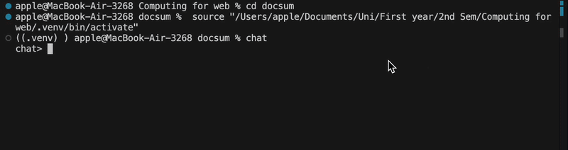

# Python LLM Chat Agent

[](https://github.com/LucyyyyyyT/python_llm/actions/workflows/doctests.yml)
[](https://github.com/LucyyyyyyT/python_llm/actions/workflows/test_integration.yml)
[](https://github.com/LucyyyyyyT/python_llm/actions/workflows/flake8.yml)
[](https://github.com/LucyyyyyyT/python_llm/actions/workflows/test.yml)
[](https://pypi.org/project/python-llm-lucy/)

A chat agent that depends on command line and uses Groq's LLM API. It is able to hold conversations and answer questions. It can also call built-in tools: `calculate`, `cat`, `grep`, `ls`, `doctests`, `write_file`, `rm`.



## Usage

### Exploring a project's file structure

This example shows how the agent can explore a project and answer questions about it.

```
$ cd docsum
$ chat
chat> what files are in this project
Here's the directory tree of the current project:

python_llm/
├── chat.py
└── tools/
    ├── calculator.py
    ├── filesystem.py
    └── search.py

chat> what does chat.py do
chat.py defines a Chat class that connects to the Groq LLM API,
maintains conversation history, and supports tool calling for
ls, cat, grep, and calculate.
```

### Creating files with the agent

The session below demonstrates that the agent can create files and
automatically commit them to git.

```
$ ls -a
.git  AGENTS.md  README.md  python_llm/  requirements.txt  setup.cfg
$ git log --oneline
86b74ed (HEAD -> project4) coverage badge
$ chat
chat> create a file called hello.py that prints hello world
The file hello.py has been added. It contains a main function that prints
"hello world" and includes doctests.
chat> ^C
$ ls -a
.git  AGENTS.md  README.md  hello.py  python_llm/  requirements.txt  setup.cfg
$ git log --oneline
f01358c [docchat] Add hello.py that prints hello world
86b74ed coverage badge
```

### Deleting files with the agent

The session below demonstrates that the agent can delete files and
automatically commit the removal to git.

```
$ chat
chat> delete the file hello.py
The file hello.py has been removed from the repository.
chat> ^C
$ ls -a
.git  AGENTS.md  README.md  python_llm/  requirements.txt  setup.cfg
$ git log --oneline
a2b3c4d [docchat] rm hello.py
f01358c [docchat] Add hello.py that prints hello world
86b74ed coverage badge
```